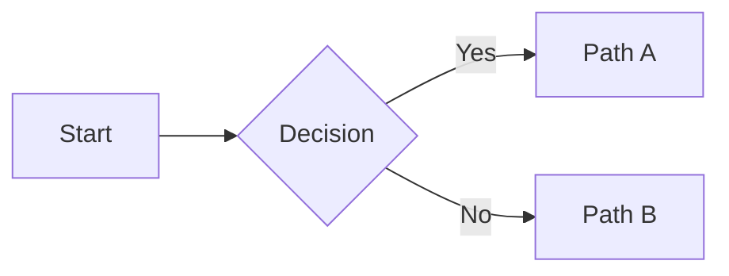

# Khalil's Notes — 写作 / 运维使用说明

> 面向作者本人的速查。主题：写文章、改页面、发布、出问题怎么办。
>
> 跟 `deploy/first-deploy-checklist.md` 是两份文档：那份是"零到一部署站点"，
> 这份是"站点已经在线，日常怎么用"。

---

## 目录速记

```
src/
├── content/posts/          写文章的地方（每篇一个目录）
│   └── YYYY-MM-DD-slug/
│       ├── index.mdx       正文
│       └── assets/         这篇文章用到的图
├── components/             可复用组件（Figure、TOC、Tag 等）
├── layouts/                BaseLayout、PostLayout
├── pages/                  路由（index、archive、about、404、tags/、posts/）
├── styles/                 设计系统
│   ├── tokens.css            颜色 / 字体栈 / 尺寸 / @font-face
│   ├── global.css            reset + 站点级
│   ├── typography.css        正文排版 (.prose)
│   └── code.css              代码块 + shiki 双主题
└── lib/                    工具函数（slug、日期、阅读时长、shiki transformer）

public/
├── fonts/                  自托管 woff2
├── favicon.svg
└── robots.txt

deploy/                     Nginx / GitHub Actions 参考模板（上线用）
```

---

## 日常工作流（改任何东西都是这三步）

```bash
cd /mnt/e/blog
npm run dev                    # 本地预览 http://localhost:4321
# ... 改文件、看效果、继续改 ...
git add -A
git commit -m "简短描述"
git push                       # 触发 GitHub Actions → 3-5 分钟后上线
```

查看部署进度：**https://github.com/Autumn1337/khalilgao-blog/actions**（四步全绿即上线）。

---

## 写新文章

### 目录命名

```bash
mkdir -p src/content/posts/2026-05-10-shiki-dual-theme/assets
```

`YYYY-MM-DD-slug` 是**目录名约定**，日期只为本地按时间扫描方便。**URL 会自动去掉日期前缀**，变成 `/posts/shiki-dual-theme/`。

### `index.mdx` 最小模板

```mdx
---
title: 标题
description: 一句话摘要（进首页卡片 + meta description + OG）
pubDate: 2026-05-10
tags: [c++, algorithms]
---

正文从这里开始写。从 H2 开始（H1 由 frontmatter.title 自动渲染）。

## 第一节

段落文字。
```

### Frontmatter 字段全表

| 字段 | 类型 | 默认 | 作用 |
|---|---|---|---|
| `title` | string | **必填** | 文章标题（H1 + tab 标题 + OG） |
| `pubDate` | date | **必填** | 发布日期，ISO 格式 `2026-05-10` |
| `description` | string | — | 摘要；缺省时首页卡片自动从正文截前 140 字 |
| `updatedDate` | date | — | 更新日期，显示为 "更新于 YYYY-MM-DD" |
| `tags` | string[] | `[]` | 标签列表；自动汇总到 `/tags/` 页 |
| `toc` | boolean | `true` | 是否显示 TOC 侧栏（H2/H3） |
| `draft` | boolean | `false` | `true` = 生产构建跳过，本地 dev 可见 |
| `lang` | `'zh'` \| `'en'` | `'zh'` | 语言代码（影响 `<html lang>` 和 OG `og:locale`） |

### 标签约定

- 全小写、多词用连字符：`computational-geometry` 而非 `ComputationalGeometry`
- 英文优先（URL 和跨语言搜索友好）
- 单篇 3–5 个为宜，不超过 7
- 特殊字符自动处理：`c++` → URL `/tags/c-plus-plus/`，`c#` → `/tags/c-sharp/`

---

## MDX 组件速查

### 图片 —— Figure / WideFigure

**推荐方式**：文件放 `./assets/`，MDX 顶部 import 进来。

```mdx
import Figure from '../../../components/Figure.astro';
import WideFigure from '../../../components/WideFigure.astro';
import fig1 from './assets/fig1.svg';
import fig2 from './assets/fig2.png';

<Figure src={fig1} alt="描述" caption="图 1. 图注文字" />

<WideFigure src={fig2} alt="..." caption="..." />
```

- `<Figure>` —— 正文列宽（680px）
- `<WideFigure>` —— 突破到 960px（仅在 `toc: false` + 视口 ≥1100px 时真正扩展；有 TOC 的页面上退化为正文宽）
- 深色主题下浅色截图自动加 8px 白底 cushion，不想要加 `noCushion` 属性
- 点击图片自动 medium-zoom 放大

**不要**用 `` 或裸 ``——只有走 `<Figure>` 才有懒加载、懒优化、点击放大。

### 代码块 —— 带文件名 + 行高亮

````markdown
```cpp main.cpp {3-5,8}
#include <iostream>
int main() {
  // 第 3-5 行和第 8 行会被高亮
  int x = 1;
  int y = 2;
  return 0;
  // (空行算)
  std::cout << x;
}
```
````

- ` ```lang` 后接可选 `filename` —— 识别规则是"含点的 token"，所以 `main.cpp` / `src/foo.ts` / `Makefile.am` 都行
- `{1,3-5}` 是行号列表，逗号分隔，`a-b` 表示范围
- 右上角有复制按钮（hover 浮现），点击变 "已复制" 1.5 秒
- 双主题由 Shiki 自动处理：light → `github-light`，dark → `github-dark-dimmed`，切换主题瞬间变色

### Mermaid 图

````markdown

````

客户端懒加载，第一个 mermaid 进视口时才下载库。主题切换时自动重渲染。

### 数学公式 — KaTeX

行内：`这里 $E = mc^2$ 是质能方程`

块级：

```
$$
A \oplus B = \lbrace a + b : a \in A, b \in B \rbrace
$$
```

**`{` 的陷阱**：MDX 3 把正文里裸 `{` 当 JSX 表达式。规则：

| 位置 | `{` 安全吗？ |
|---|---|
| block/inline math (`$$...$$` / `$...$`) | ✅ 包括 `\mathrm{}`、`\frac{}{}`、`\operatorname{}` 等 |
| inline code (反引号内) | ✅ |
| fenced code block | ✅ 包括 mermaid 的 `B{决策}` 菱形节点 |
| JSX 属性 (`<Comp prop={x}/>`) | ✅ |
| **正文纯文本** | ❌ **必须转义成 `\{`** |

遇到不确定的，`scripts/mdx-math-probe.mjs` 里有探测用例。

### 脚注（GFM 语法）

```markdown
这里需要注释[^1]。

这里多个[^note1][^note2]。

[^1]: 第一条脚注内容。
[^note1]: 命名也可以。
[^note2]: 顺序按引用顺序自动编号。
```

页底自动汇总"Footnotes"段落。

### 引用块

```markdown
> 引用的原文。
> 可多段。
```

左侧 2px 实线 + muted 斜体。

### 表格

```markdown
| 方案 | 复杂度 | 备注 |
| --- | --- | --- |
| 朴素 | O(n²) | 简单但慢 |
| 分治 | O(n log n) | 推荐 |
```

使用 UI 字体 + 粗表头分隔线 + 细行分隔线。

### 行内强调

```markdown
**粗体** *斜体* `代码`

[链接文字](https://example.com)
```

---

## 草稿工作流

### 写了一半先存着

```yaml
---
title: 还没写完
pubDate: 2026-05-10
draft: true
---
```

- `npm run dev` **能看到**（本地方便继续写）
- `npm run build` / 生产部署**跳过这篇**（不进首页、不进归档、不进标签页、不进 RSS）

### 发布时把 `draft: true` 删掉（或改 `false`）再 push。

---

## 首页 / 归档 / 标签页 / 关于页的修改

- 首页介绍段：`src/pages/index.astro` 里的 `<section class="home-intro">` 直接改文字
- 归档页：`src/pages/archive.astro`，纯由 `getCollection` 动态生成，通常不用动
- 标签页：`/tags/` 标签云 + `/tags/<slug>/` 列表，同上，动态
- 关于页：`src/pages/about.astro` 改里面的 H2 / 段落

改完本地 `npm run dev` 看完再 push。

---

## 回滚 / 出错

### 刚 push 发现内容写错了

直接在本地改，再 `git add + commit + push`。新版会覆盖。

### 部署失败（Actions 红叉）

1. 去 https://github.com/Autumn1337/khalilgao-blog/actions 看红色那步的 log
2. 常见：
   - **Check 红** → `astro check` 报 TypeScript / 内容 schema 错，按 log 改 mdx frontmatter 或代码
   - **Build 红** → 通常是 MDX 语法错（JSX `{` 之类）
   - **Deploy 红** → rsync 连接或 key 问题，最近配过就不用再担心

### 想回到上一版站点

最干净：`git revert <坏 commit>` → push。revert commit 会触发新部署，内容回到之前。

```bash
git log --oneline | head -5             # 找到坏 commit 的 SHA
git revert <sha>                         # 生成 revert commit
git push
```

### 线上挂了但 GitHub 看不出问题

```bash
ssh root@<VPS_IP>                        # IP 见 docs/local/RUNBOOK.md
systemctl status nginx sing-box          # 哪个 service 红 = 先看 journalctl
journalctl -u nginx -n 30 --no-pager
curl -I http://localhost/                # 本机 nginx 通不通
```

---

## 运维速查

| 操作 | 命令（VPS 上 root） |
|---|---|
| Nginx 语法检查 | `nginx -t` |
| Nginx 热 reload | `systemctl reload nginx` |
| Nginx 重启 | `systemctl restart nginx` |
| 手动续证书 | `certbot renew --dry-run` 先演练，`certbot renew` 真跑 |
| 看证书剩余天数 | `certbot certificates` |
| 看 ufw 规则 | `ufw status numbered` |
| 看端口谁在监听 | `ss -tlnp \| grep <port>` |
| 看 GHA 部署日志 | 浏览器 Actions tab |
| sing-box 状态 | `systemctl status sing-box` |
| 查 nginx 请求日志 | `tail -f /var/log/nginx/access.log` |
| 查 nginx 错误 | `tail -f /var/log/nginx/error.log` |

---

## 性能预算（spec §9）

每次发文章后花 30 秒自测一次：

- **Lighthouse 桌面分** ≥ 95：Chrome DevTools → Lighthouse → Performance
- **LCP** < 1.5s 国内直连
- **首页 HTML**（Brotli / gzip 压缩后）< 20 KB
- 单篇图片 < 200 KB（用 Astro 自动生成 AVIF/WebP）

性能问题通常是图片太大或某篇引了太多字体/字形。

---

## 本地开发环境

### 首次 clone 新机器

```bash
git clone git@github.com:Autumn1337/khalilgao-blog.git
cd khalilgao-blog
npm ci                           # 完整装依赖
npm run dev
```

如果 SSH 还没配在新机器，先生 key → 贴 GitHub：见 `docs/local/RUNBOOK.md` 里"SSH 配置"段。

### WSL 特别说明

- `/mnt/e/` 是 NTFS，inotify 不发事件 → `astro.config.mjs` 里已经配了 `usePolling: true`，不用自己加
- dev toolbar 右下角图标已在 config 里关了

### 常用 npm 脚本

```bash
npm run dev          # 开发服务器
npm run build        # 生产构建到 dist/
npm run preview      # 本地预览构建产物（npm run build 之后跑）
npm run check        # astro check（TypeScript + 内容 schema 校验）
```

---

## 附录：已知限制 / 未完成

- **HTTP/3**：Debian 12 的 nginx 1.22 不支持 QUIC，当前走 HTTP/2。要启用需升级 nginx 到 1.25+（参考 `deploy/nginx.conf` 里的注释）。
- **Brotli**：Debian 12 源没有 `libnginx-mod-http-brotli`，当前只走 gzip。影响：HTML/CSS 压缩率减 15-20%。
- **全文搜索**：未做。v2 计划用 Pagefind（构建时生成索引）。
- **评论**：未做。v2 计划用 Waline 自部署，Nginx 已预留 `/api/waline/` location。
- **统计**：未做。v2 考虑 GoatCounter 自部署。
- **英文版**：spec 有 `lang: 'en'` 字段，但路由没分流。将来加 `/en/` 前缀。

---

## 出问题问我

我（Claude）记得这份 spec 的每一处设计选择。碰上"为什么我改了 X 但没生效"这种问题，直接把情况贴过来，我帮你定位。
